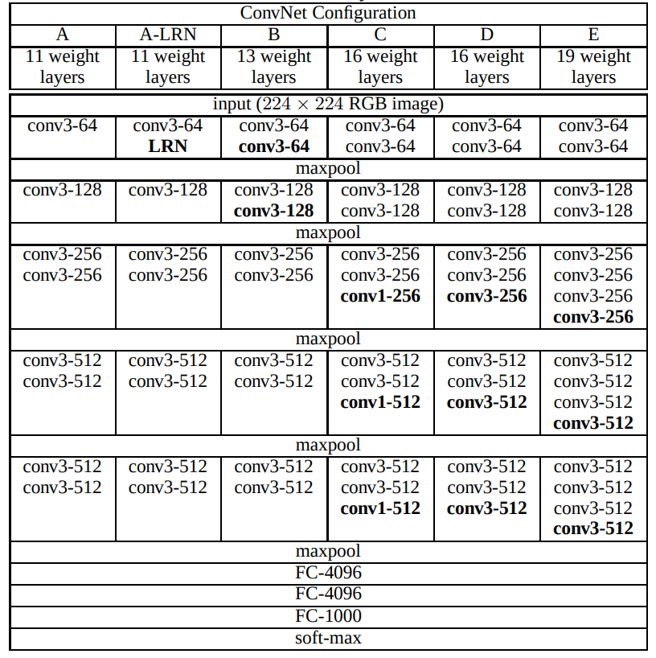
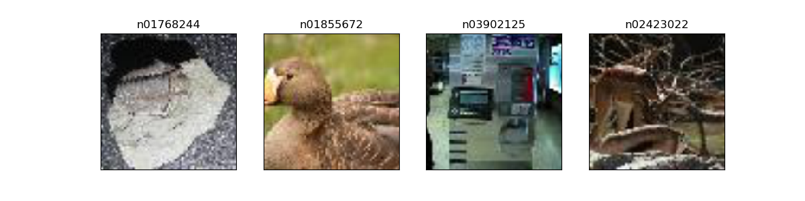
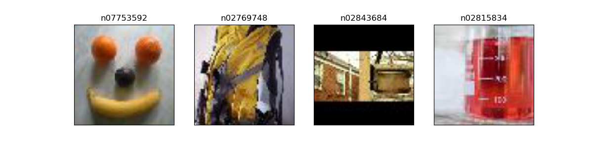
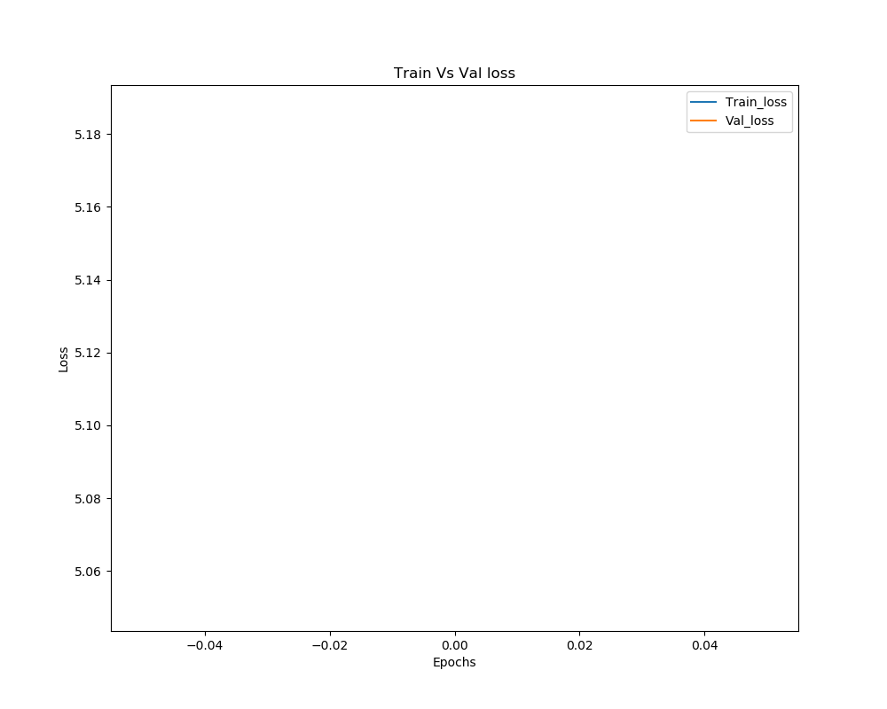
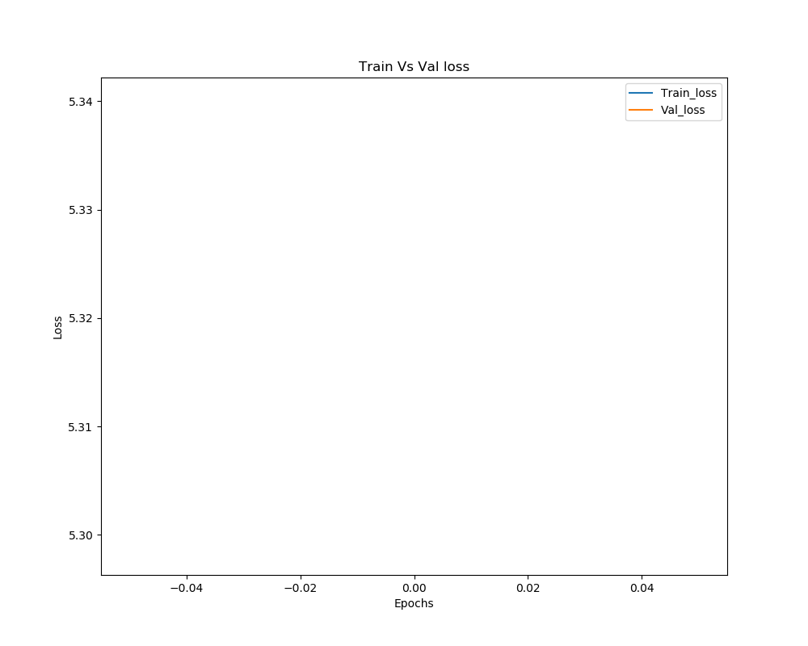
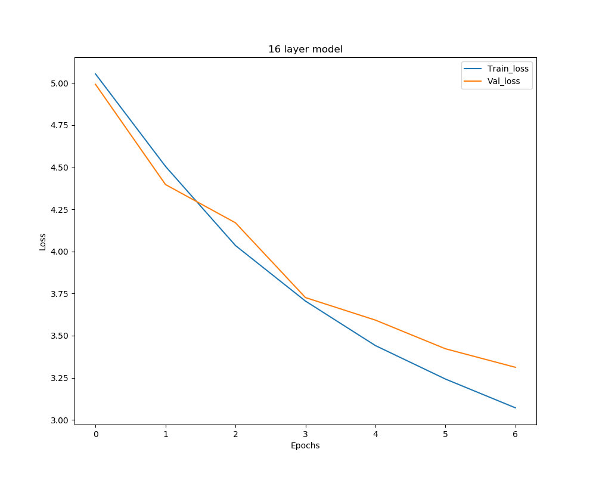
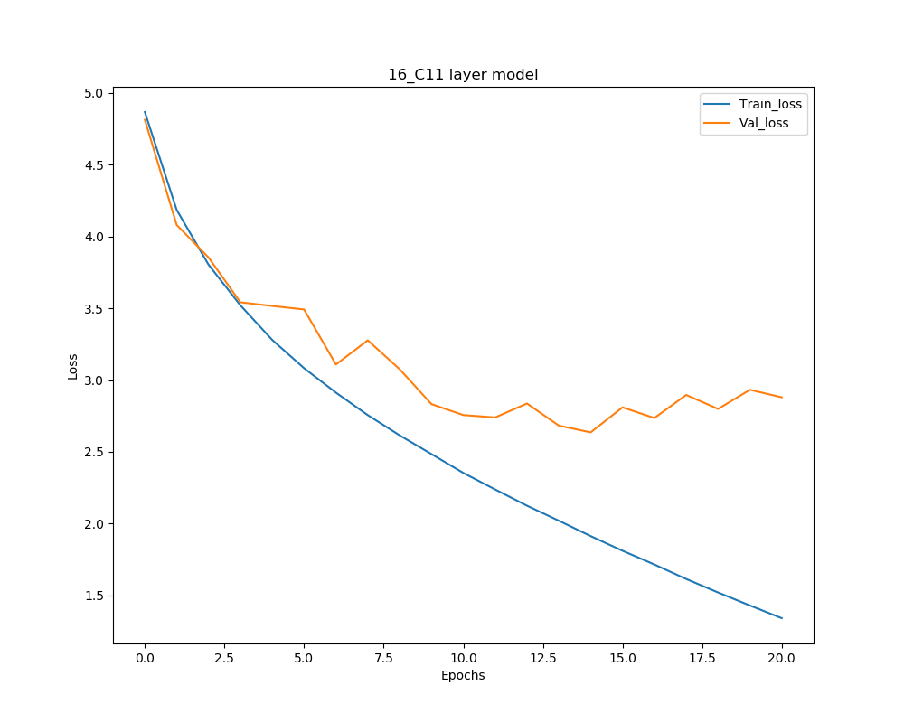
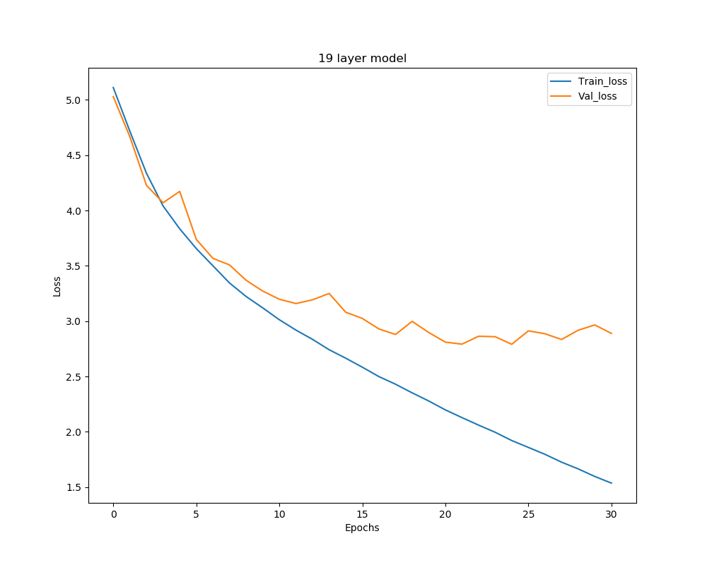

# Very-Deep-Convolutional-Networks-for-Large-Scale-Image-Recognition

This project work is a implementation of [Very Deep Convolutional Networks for Large-Scale Image Recognition](https://arxiv.org/pdf/1409.1556.pdf) in Pytorch. 
However, the dataset used for this project is from [Tiny ImageNet Visual Recognition Challenge](https://tiny-imagenet.herokuapp.com/). Model performance can be 
improved by using smaller convolutional filter
(i.e feature extraction maps) with 3x3 size while increasing network layer depth.  

### Model Architecture
The models were implemented as per original paper description, which can be seen in the following figure.

### Dataset

The dataset is devided in to 3 sets:

- Trainset is composed with 200 clasess and each class has 200 samples with a 64x64 pixels
- Validationset has composed with a 50 samples per each class. 
- Testset is a total size 10000 samples.

<b>Sample images from trainset:</b>

<b>Sample images from validationset:</b>

### Computing resources 
The models were trained on GPU, which is having a configuration of Nvidia-GTX 1070 8gb. Each model has took approx. 14h to 20h for training.  

### Results

<b>Model performance plots:</b>

   

   

<!--
-->
<!--  -->
<!--  -->
<!--  -->
<!--  -->
<!--  -->
<!--
-->

<!--
-->
<!--  <button class="tablinks" onclick="openCity(event, 'London')">London</button>-->
<!--  <button class="tablinks" onclick="openCity(event, 'Paris')">Paris</button>-->
<!--  <button class="tablinks" onclick="openCity(event, 'Tokyo')">Tokyo</button>-->
<!--
-->

<!--
-->
<!--  <h3>London</h3>-->
<!--  
London is the capital city of England.
-->
<!--
-->

<!--
-->
<!--  <h3>Paris</h3>-->
<!--  
Paris is the capital of France.
 -->
<!--
-->

<!--
-->
<!--  <h3>Tokyo</h3>-->
<!--  
Tokyo is the capital of Japan.
-->
<!--
-->

<!---->

<b>Accuracy:</b>

|layers Vs Dataset    | Trainset | Valset | Testset |
|-------------------|----------|--------|---------|
| 11 layers         | 0.4800       |  0.3591      |         |
| 13 layers         | 0.5133       |  0.4001    |         |
| 16 layers         |  0.5140      |   0.3809     |         |
| 16 layers, Cf:1x1 |  0.4932        |    0.3845    |         |
| 19 layers         |    0.4890      | 0.3563       |         |

<b>Loss:</b>

|layers Vs Dataset    | Trainset | Valset | Testset |
|-------------------|----------|--------|---------|
| 11 layers         |  2.03        |  2.75  |         |
| 13 layers         |  1.85        | 2.57       |         |
| 16 layers         |  1.83        |    2.64    |         |
| 16 layers, Cf:1x1 |   1.91       |     2.63   |         |
| 19 layers         |      1.92    |   2.79     |         |

### Usage

Very Deep Convolutional Networks for Large Scale Image Recognition
    
    [-h] [-t TRAIN] [-v VAL] [-b {64,128,256}] [-e {50,100,150}]
    [-d {11,13,16,19}] [-c11] [-es EARLY_STOPPING] [-i IMAGESIZE] [-lr LR]

 optional arguments:
 
      -h, --help            show this help message and exit
      -t TRAIN, --train TRAIN
                            required image dataset for training a model. It must
                            be in the data directory
      -v VAL, --val VAL     required image dataset for training a model. It must
                            be in the data directory
      -b {64,128,256}, --batchsize {64,128,256}
                            select number of samples to load from dataset
      -e {50,100,150}, --epochs {50,100,150}
      -d {11,13,16,19}, --depth {11,13,16,19}
                            depth of the deep learning model
      -c11, --conv1_1       setting it True will replace some of the 3x3 Conv
                            layers with 1x1 Conv layers in the 16 layer network
      -es EARLY_STOPPING, --early_stopping EARLY_STOPPING
                            early stopping is used to stop training of network, if
                            does not improve validation loss
      -i IMAGESIZE, --imagesize IMAGESIZE
                            it is used to resize the image pixels
      -lr LR, --lr LR       learning rate for an Adam optimizer

<b>Example usage:</b>

For training a model having a layer depth of 11:
            
    python train.py -d 11 -e 50 -es 5 -b 50 
           
For training a model having a layer depth of 16 along with smaller Conv filter 1x1:
        
    python train.py -d 16 -c11 -e 50 -es 5 -b 50 

